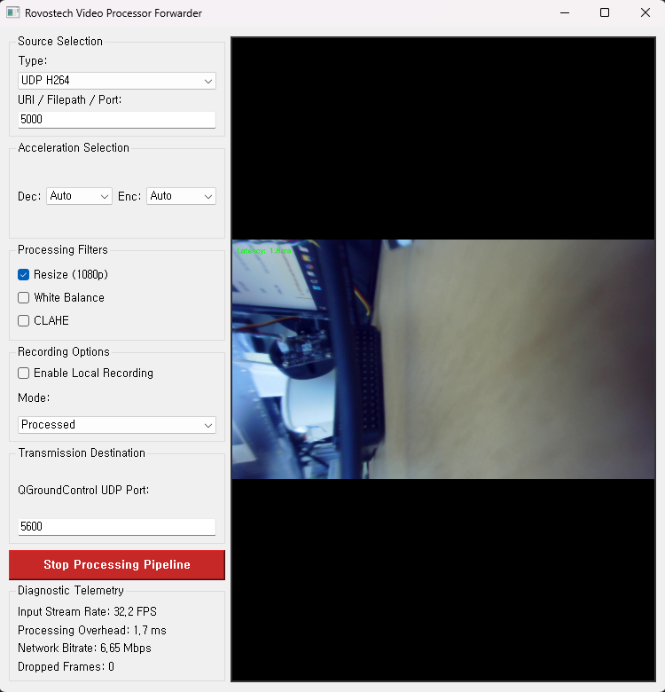
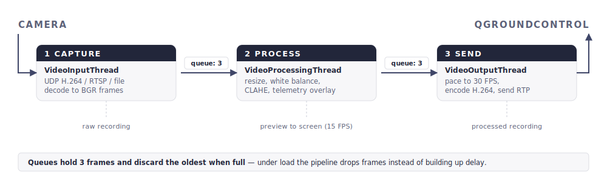
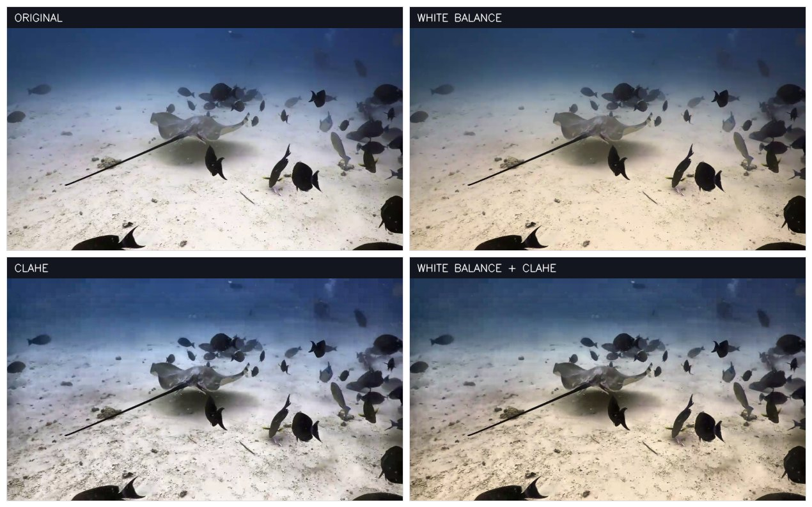
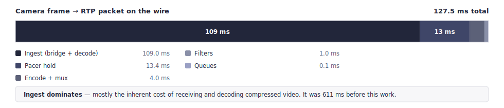

# Rovostech Video Processor Forwarder

Real-time video processing and forwarding for ROVs, USVs and subsea work. Takes video from a
camera, processes it for underwater viewing, and forwards it to **QGroundControl** — optionally
recording a local copy.

It is also a **starting point for your own image processing.** Capture, threading, encoding and
streaming are already built and measured; you write one function.

**Run it with:** `python CameraProcessForwarder.py`

To access the report, access the link below
📖 **[View the Documentation & Guide](https://rndrovostech.github.io/VideoProcessorForwarder/report.html)**

---

## Contents

1. **[Install](#1-install)**
2. **[How to use it](#2-how-to-use-it)**
3. **[How the system works](#3-how-the-system-works)**
4. **[Add your own image processing](#4-add-your-own-image-processing)** ← start here to extend
5. [Build a standalone executable](#5-build-a-standalone-executable)
6. [Notes from development](#6-notes-from-development)
7. [Known limitations](#7-known-limitations)

---

# 1. Install

## Step 1 — External programs

| Program | Needed for | Required? |
|---|---|---|
| **FFmpeg** | Encoding, transmitting, recording, reading network video | Always |
| **GStreamer** | Receiving UDP H.264 | Only for the UDP H264 source |

Both must be on your system `PATH`. For GStreamer install **both** the *runtime* and *devel*
x86_64 MSVC packages: <https://gstreamer.freedesktop.org/data/pkg/windows/1.18.6/msvc/>

> **GStreamer is found automatically.** The app checks your `PATH`, the environment variable the
> installer sets, and the usual folders on drives C: through G: — so an install on `D:\` works
> without any configuration.

## Step 2 — Python packages

```bash
python -m venv venv
venv\Scripts\activate

pip install numpy PyQt5 opencv-python opencv-contrib-python
```

> **Install `opencv-contrib-python`, not just `opencv-python`.** White Balance needs the
> `cv2.xphoto` module, which the basic package omits. Without it the app still runs — that one
> checkbox does nothing, and a warning is printed.

## Step 3 — Run it

```bash
python CameraProcessForwarder.py
```

Tested on Windows 11, Python 3, OpenCV 4.13, FFmpeg 8.1.

---

# 2. How to use it

1. **Choose your video source** at the top left. The box below fills in an editable default.
2. **Choose an encoder** under *Enc:* — `NVENC` for NVIDIA, `Intel QSV` for Intel graphics.
   `Auto` currently means software encoding.
3. **Tick the filters** you want. These can be changed **while the video is running.**
4. **Set the destination port** — `5600` is QGroundControl's normal video port.
5. **Click Start Processing Pipeline.** The button turns red; click again to stop.

In QGroundControl: *Application Settings → Video* → **UDP h.264 Video Stream**, same port.



*Receiving UDP H.264 on port 5000, resizing to 1080p, forwarding to QGroundControl on 5600.
Telemetry: 32.2 FPS in, 1.7 ms of filtering per frame, 6.65 Mbps out, no dropped frames.*

## Video sources

| Source | What to type in the box | Example |
|---|---|---|
| **UDP H264** | Just the port number | `5000` |
| **RTSP** | The full camera address | `rtsp://192.168.2.160:554/stream1` |
| **Video_File** | Path to an MP4 or MKV | `./UnderwaterVideoPlayback720.mp4` |

> **UDP H264 also uses the next port up.** Entering `5000` means the app occupies `5001` too.

## Recording

Tick **Enable Local Recording** and pick a mode:

| Mode | What you get |
|---|---|
| **Processed** | Exactly what is being sent out, filters included |
| **Raw Original** | The untouched camera feed, original size, before any filtering |

Saved beside the app as `ROV_Record_processed_<n>.mp4` or `ROV_Record_raw_<n>.mp4`, always at the
correct speed even if the computer could not keep up.

## Reading the telemetry

| Readout | What it tells you | Healthy |
|---|---|---|
| **Input Stream Rate** | Frames arriving from the camera | Steady, matching your camera |
| **Processing Overhead** | Time spent filtering one frame | Under 33 ms |
| **Network Bitrate** | Actual data crossing the tether | Depends on your link |
| **Dropped Frames** | Frames discarded because a stage fell behind | 0, or rising slowly |

**Processing Overhead is the number to watch when writing your own filters.** It is also drawn
onto the video, so the pilot sees it without looking at the app.

## If something goes wrong

| Message or symptom | Likely cause |
|---|---|
| `Could not find GStreamer installation` | Not installed, or not on your `PATH`. |
| `'x' is not a valid UDP port` | For UDP H264, type only a port number — not a full address. |
| `could not open video file` | Wrong path, or a format the app cannot read. |
| `Error: FFmpeg could not open ...` | Nothing transmitting yet, or the port is in use. |
| White Balance does nothing | `opencv-contrib-python` missing — check the console warning. |
| Nothing appears in QGroundControl | QGC not set to *UDP h.264* on the same port. |
| Video freezes or tears after a glitch | Tether packet loss. A keyframe is sent every second to recover. |
| Your own filter crashes | The traceback is printed to the console, not the window. |
| `did not stop within 3s` when stopping | A dead network source is blocking a read. Harmless. |

When FFmpeg or GStreamer fails, the last lines of its error output are printed, tagged
`[ffmpeg-rtp]`, `[ffmpeg-rec]`, `[ffmpeg-raw]`, `[ffmpeg-in]` or `[gstreamer]`.

---

# 3. How the system works

Three jobs — **get data**, **process data**, **send data** — each on its own thread. They never
call each other; they pass frames through queues. In one loop a slow encoder would stall the
camera and freeze the window.



**The frame never changes form.** From capture until encoding it is one thing: **an OpenCV BGR
image — a numpy `uint8` array of shape `(height, width, 3)`.** That is why any OpenCV code can be
dropped into the middle and it just works.

## Stage 1 — Getting camera data

`VideoInputThread` turns whatever the camera sends into BGR frames. It also writes the raw
recording — the only stage that still has unfiltered video.

| Source | How it is read | Why |
|---|---|---|
| **Video file** | OpenCV `VideoCapture` | Needs seeking so playback can loop |
| **RTSP camera** | FFmpeg, driven directly | Low latency |
| **UDP H.264** | GStreamer bridge → FFmpeg | Low latency |

For a UDP H.264 stream the data takes two hops:

```
ROV camera ──RTP/H.264──▶ udp:5000 ──[GStreamer bridge]──▶ udp:5001 ──[FFmpeg]──▶ BGR frames
                                      unpacks RTP,                    decodes H.264
                                      repacks as MPEG-TS
```

## Stage 2 — Processing data

`VideoProcessingThread` is the stage **you will modify.** It normalises the frame to 3-channel
BGR, runs `apply_filters()`, measures the cost, draws that number onto the frame, passes it on,
and updates the preview at most 15 times a second.

| Filter | What it does | Why underwater |
|---|---|---|
| **Resize** | Scales to 1920×1080 | Standardises output |
| **White Balance** | Grayworld colour correction | Water absorbs red and yellow — everything looks blue-green |
| **CLAHE** | Adaptive local contrast | Brings out shapes in murky or dim water |



## Stage 3 — Sending data

`VideoOutputThread` pipes frames into FFmpeg, which encodes H.264 and sends it as RTP. **The
output is paced to a steady 30 FPS** — if your processing is slow the newest frame is *repeated*
rather than letting the stream fall behind real time.

## How the stages connect

**Each queue holds only 3 frames, and throws away the oldest when full.** That one rule defines
behaviour under load: when a stage cannot keep up, old frames are discarded rather than piling
up — right for live pilot video, where a two-second-old frame is worthless.

> **Slow processing costs frames, not delay.** You can experiment with expensive algorithms
> without the video drifting behind reality.



Measured end to end, camera frame to network packet: **about 128 ms.** QGroundControl adds its
own buffering on top, usually 100–200 ms, outside this app's control.

---

# 4. Add your own image processing

## The one function you need

Find `apply_filters()` in `VideoProcessingThread`
([CameraProcessForwarder.py](CameraProcessForwarder.py)) and write your OpenCV code there:

```python
def apply_filters(self, frame):
    # frame is a BGR image: numpy uint8 array, shape (height, width, 3)

    if self.config["resize"]:
        frame = cv2.resize(frame, (1920, 1080), interpolation=cv2.INTER_LINEAR)

    # ... the built-in filters ...

    # --- your own stages go here ---

    return frame
```

## Or subclass it, without touching the original

Recommended — it keeps your work separate and makes updates easier:

```python
import cv2
import CameraProcessForwarder as cpf

class MyProcessor(cpf.VideoProcessingThread):
    def apply_filters(self, frame):
        frame = super().apply_filters(frame)     # keep the built-in filters
        # ---- your processing ----
        gray  = cv2.cvtColor(frame, cv2.COLOR_BGR2GRAY)
        edges = cv2.Canny(gray, 80, 160)
        frame[edges > 0] = (0, 0, 255)           # paint detected edges red
        return frame

# then use MyProcessor instead of VideoProcessingThread in toggle_pipelines()
```

Drop `super().apply_filters(frame)` to replace the built-in filters entirely.

## The rules

| # | Rule | Why |
|---|---|---|
| 1 | Return **BGR uint8, 3 channels** | Convert back before returning if you work in grey/HSV/LAB, or the encoder rejects the frame |
| 2 | Keep the frame **size consistent** | Stream geometry locks to the first frame; later changes get rescaled and waste work |
| 3 | Watch **Processing Overhead** | Under 33 ms holds 30 FPS. Slower is not fatal — you lose frames, not real time |
| 4 | **Never touch Qt widgets** from this method | It is a worker thread. Use `self.stats_callback("proc_time", "...")` to send numbers to the GUI |
| 5 | Build expensive objects **once in `__init__`** | Not per frame. See how `self.clahe` is created |

## Adding your own on/off switch

Filters are controlled by `self.config`, a plain dictionary shared with the GUI. Three edits give
your filter a checkbox:

```python
# 1. in ROVProcessorApp.__init__, add a default:
self.proc_config = { ..., "my_filter": False }

# 2. in initUI, create the checkbox and connect it:
self.chk_mine = QCheckBox("My Filter")
proc_layout.addWidget(self.chk_mine)
self.chk_mine.stateChanged.connect(self.sync_config)

# 3. in sync_config, copy its state across:
self.proc_config["my_filter"] = self.chk_mine.isChecked()
```

Then read it with `if self.config["my_filter"]:`. The value updates live, so you can toggle your
algorithm while the video is running.

## Where to put other kinds of work

| You want to… | Do it in |
|---|---|
| Change how the picture looks | `apply_filters()` |
| Detect something and report a number | `apply_filters()`, then `self.stats_callback(...)` |
| Draw boxes, text or masks on the video | `apply_filters()` — it is a normal OpenCV image |
| Support a new camera or protocol | `VideoInputThread.open_source()` |
| Change encoding or streaming | `VideoOutputThread.start_ffmpeg()` |

**While developing, use Video_File as your source.** It loops forever, replays identical frames
every run, and needs no camera or network — then switch to the live source when it works.

---

# 5. Build a standalone executable

For machines with no Python installed. Needs `pip install pyinstaller`.

```bash
pyinstaller CameraProcessForwarder.spec
```

Output is `dist\CameraProcessForwarder\` — about **243 MB**, mostly OpenCV. Run
`CameraProcessForwarder.exe` inside it. `build\` and `dist\` are gitignored.

- **Ship the whole folder, not just the .exe.** It is a one-directory build.
- **FFmpeg and GStreamer are not bundled.** The target machine still needs
  [Step 1](#1-install) of the install, but not Step 2. Both are found at runtime, and GStreamer
  does not relocate into a bundle cleanly.

## Building without the spec file

The same build as a single command:

```bash
pyinstaller --noconfirm --console --name CameraProcessForwarder --icon images/AppIcon.ico --add-data "images/AppIcon.ico;images" --hidden-import cv2.xphoto CameraProcessForwarder.py
```

> **This overwrites `CameraProcessForwarder.spec`.** PyInstaller regenerates the spec from your
> flags whenever it is given a `.py` file. Pass `--specpath` somewhere else to keep the tracked one.

## Why those flags

| Flag | Reason |
|---|---|
| `--hidden-import cv2.xphoto` | Reached via `hasattr(cv2, "xphoto")`, so static analysis misses it. Drop it and the build still succeeds — White Balance just silently does nothing. |
| `--icon` **and** `--add-data` | `--icon` stamps the .exe for Explorer; `--add-data` ships the file so the Qt window icon works at runtime. Both are needed. |
| `--console` | Every diagnostic — `[ffmpeg-rtp]`, `[gstreamer]`, filter tracebacks — goes to stdout. A windowed build discards them all. |
| one-directory (default) | `--onefile` re-extracts OpenCV's DLLs to a temp folder on every launch. Slow, no benefit. |

The spec also lists `excludes`, which are insurance against a future import pulling in something
heavy — measured, they make no difference to the current build size.

## The app icon

`images/AppIcon.svg` is the artwork; `images/AppIcon.ico` is what Qt and PyInstaller read. Edit the
SVG, then regenerate:

```bash
python images/make_icon.py
```

Draws with OpenCV and NumPy only, so there is no SVG rasteriser to install. Renders at 8× and
downsamples, which is what keeps the 16 px entry legible.

> Running **from source**, the taskbar icon also depends on
> `SetCurrentProcessExplicitAppUserModelID` in `__main__`. Without it Windows groups the app under
> `python.exe` and shows the Python logo regardless of `setWindowIcon`.

## Checking a build

Start it against a video file: source **Video_File**, point it at
`UnderwaterVideoPlayback720.mp4`, tick **White Balance** and **CLAHE**, start the pipeline. That
exercises decode, both contrib filters, the encoder and the output path with no camera or network.
Watch the console for warnings.

---

# 6. Notes from development

Full detail is in [CHANGELOG.md](CHANGELOG.md); the printable guide is [report.html](report.html).

Reviewed and repaired in July 2026: **14 defects fixed**, end-to-end latency cut from about
**630 ms to 128 ms**.

| Area | Fixed | Examples |
|---|---|---|
| Stream-breaking faults | 5 | An unread error pipe would freeze the encoder permanently; output was in a colour format QGC cannot play |
| Silent data loss | 3 | "Raw Original" recording wrote 0-byte files; recordings were truncated and played at the wrong speed |
| Incorrect telemetry | 3 | Network bitrate overstated ~70×; the dropped-frame counter always read 0 |
| Latency | 3 | Delay grew steadily during a dive; a hidden half-second of buffering in the video reader |

## What to do

- **Test with a video file first** — it loops, is repeatable, and needs no hardware.
- **Watch Processing Overhead** — keep filters under 33 ms; switch to a hardware encoder if tight.
- **Measure before keeping a change.** Several "obvious" improvements made things measurably worse.

## What to avoid

These all look like sensible improvements. Each was tried and measured.

| Do not | Why |
|---|---|
| Use `cv2.VideoCapture` for live network video | Buffers ~0.6 s and ignores every low-latency option, including its own documented environment variable. Drive FFmpeg directly. |
| Apply wallclock timestamps to the outgoing stream | Measured **838 ms worse**. Correct for recordings — a different problem. |
| Leave a subprocess error pipe unread | FFmpeg fills the 64 KB buffer within a minute, then blocks forever. Always drain it. |
| Change the frame size mid-stream | The encoder is fed headerless raw video; geometry is locked at the first frame for this reason. |
| Assume the source frame rate matches the output | If they differ and pacing is removed, the stream clock drifts and delay grows without limit. |

> **If the video ever looks late:** a **constant** delay is QGroundControl's own buffer and is
> normal. A delay that **grows the longer you fly** is a fault in the output pacing.

---

# 7. Known limitations

- **The `Dec:` (decoder) box does nothing.** Decoding runs on the CPU inside FFmpeg. `Enc:` works
  normally.
- **`Auto` encoder means software encoding.** No hardware detection — choose `NVENC` or
  `Intel QSV` yourself.
- **Video is only sent to `127.0.0.1`.** Port is configurable, address is not, so QGroundControl
  must run on the same computer.
- **The outgoing stream is always 30 FPS.** Change `DEFAULT_OUTPUT_FPS` in
  [CameraProcessForwarder.py](CameraProcessForwarder.py).
- **Picture size is fixed when streaming starts.** Toggling *Resize* mid-stream is safe, but the
  size sent to QGC stays as it was at the start.
- **One camera at a time.**

---

## Project files

| File | What it is |
|---|---|
| [CameraProcessForwarder.py](CameraProcessForwarder.py) | The application |
| [CameraProcessForwarder.spec](CameraProcessForwarder.spec) | PyInstaller build recipe — see [Build](#5-build-a-standalone-executable) |
| [readme.md](readme.md) | This file |
| [report.html](report.html) | Printable system guide |
| [CHANGELOG.md](CHANGELOG.md) | Full change history and planned improvements |
| `images/AppIcon.svg`, `images/AppIcon.ico` | App icon — regenerate with `images/make_icon.py` |
| `images/AppScreen.png`, `images/filterComparison.jpg` | Figures used in the docs |
| `images/Pipeline.svg`, `images/LatencyBudget.svg` | Diagrams, regenerate with `make_diagrams.py` |
| `old/main.py`, `old/main2.py` | Earlier versions, kept for reference |
